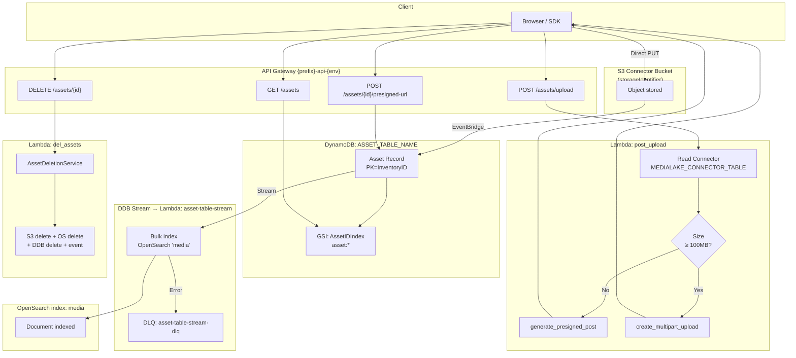
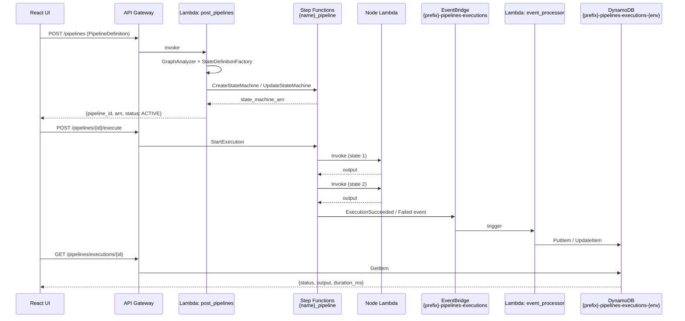
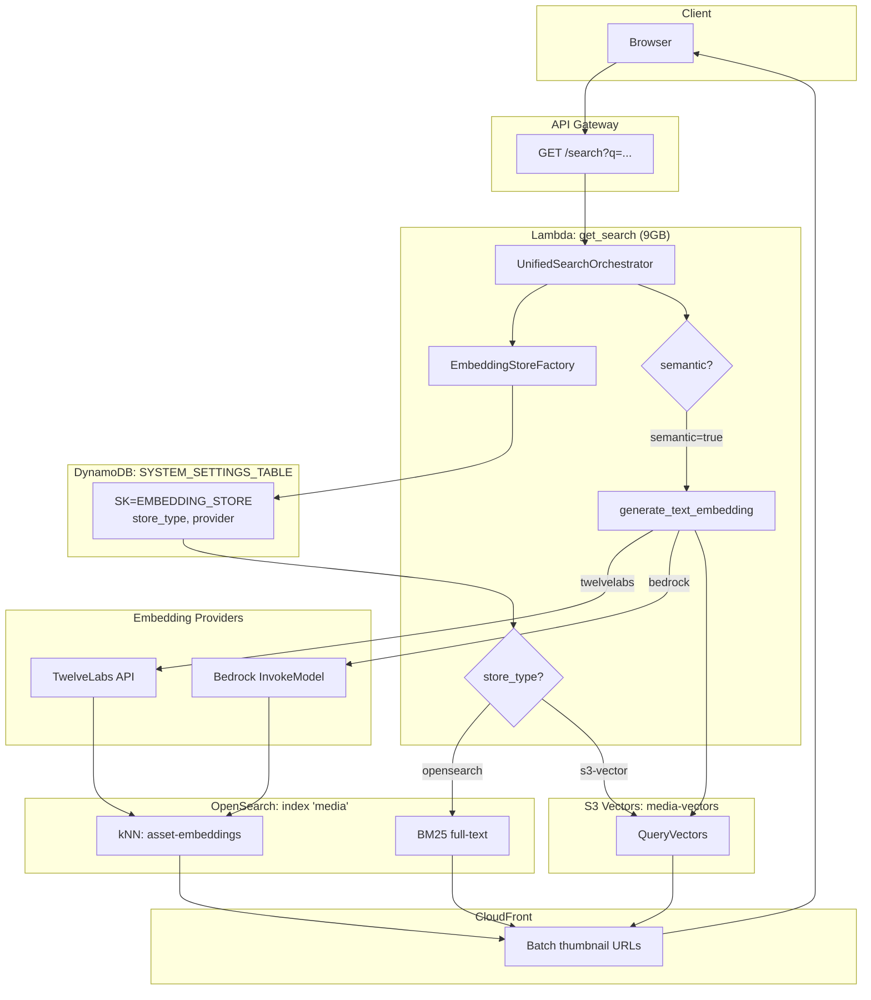
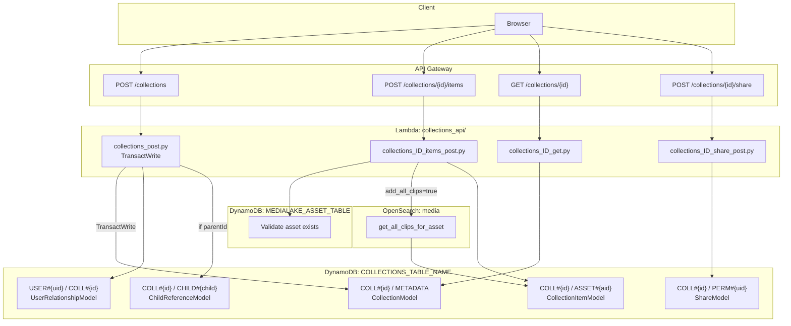
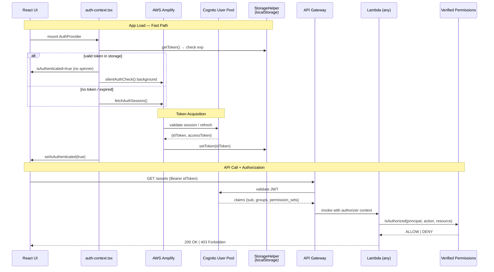

# MediaLake — Domain Deep-Dive

> Auto-generated from codebase analysis. Real resource names are used throughout.
> `<!-- TODO: verificare -->` marks items that could not be verified from source.

---

## Table of Contents

1. [Asset Management](#1-asset-management)
   - [Block A — Technical Description](#1a-technical-description)
   - [Block B — Mermaid Diagram](#1b-mermaid-diagram)
   - [Block C — Draw.io Architecture](#1c-drawio-architecture)
2. [Pipeline Engine](#2-pipeline-engine)
   - [Block A — Technical Description](#2a-technical-description)
   - [Block B — Mermaid Diagram](#2b-mermaid-diagram)
   - [Block C — Draw.io Architecture](#2c-drawio-architecture)
3. [Search Engine](#3-search-engine)
   - [Block A — Technical Description](#3a-technical-description)
   - [Block B — Mermaid Diagram](#3b-mermaid-diagram)
   - [Block C — Draw.io Architecture](#3c-drawio-architecture)
4. [Collections](#4-collections)
   - [Block A — Technical Description](#4a-technical-description)
   - [Block B — Mermaid Diagram](#4b-mermaid-diagram)
   - [Block C — Draw.io Architecture](#4c-drawio-architecture)
5. [Auth](#5-auth)
   - [Block A — Technical Description](#5a-technical-description)
   - [Block B — Mermaid Diagram](#5b-mermaid-diagram)
   - [Block C — Draw.io Architecture](#5c-drawio-architecture)
6. [Cross-Domain Integration Matrix](#6-cross-domain-integration-matrix)

---

---

## 1. Asset Management

### 1A. Technical Description

**Scope.** Asset Management covers the full lifecycle of a digital media file: upload (presigned POST or multipart), S3 storage inside a connector-owned bucket, metadata persistence in DynamoDB, sync to OpenSearch via DynamoDB Streams, presigned-URL retrieval, and deletion with cascade to all stores. All connector-level policies (bucket, prefix, allowed file types) are enforced at upload time.

#### AWS Components

| Component | Real Resource Name | Role |
|---|---|---|
| API Gateway | `{prefix}-api-{env}` (REST) | Entry point for all asset API routes |
| Lambda — upload | `lambdas/api/assets/upload/post_upload/index.py` | Validates connector, generates presigned POST or multipart upload |
| Lambda — list | `lambdas/api/assets/get_assets/index.py` | Queries DynamoDB `AssetIDIndex`, returns paginated list |
| Lambda — download URL | `lambdas/api/assets/generate_presigned_url/index.py` | Reads DynamoDB, generates S3 presigned GET or CloudFront URL |
| Lambda — delete | `lambdas/api/assets/rp_assets_id/del_assets/index.py` | Calls `AssetDeletionService`, cascades across S3/OpenSearch/vectors/DDB |
| Lambda — stream sync | `lambdas/back_end/asset_table_stream` (10 GB RAM, 15 min) | Consumes DynamoDB Stream, bulk-indexes into OpenSearch |
| S3 | Connector-specific bucket from `storageIdentifier` | Actual binary storage |
| DynamoDB | `ASSET_TABLE_NAME` / `MEDIALAKE_ASSET_TABLE` | Canonical asset record |
| DynamoDB Index | `AssetIDIndex` | GSI on `DigitalSourceAsset.ID begins_with "asset:"` |
| DynamoDB Streams | Enabled on asset table | CDC feed → `asset-table-stream` Lambda |
| OpenSearch | Index `media` | Full-text + semantic search replica |
| S3 Vectors | Index `media-vectors` | Native vector store replica (if `s3-vector` store enabled) |
| CloudFront | Thumbnail/inline distribution | CORS-safe inline viewer URL |
| DLQ | `asset-table-stream-dlq` (14-day retention) | Dead-letter for failed stream batches |
| KMS | Asset bucket + DDB encryption key | Encryption at rest |

#### Happy Path — Upload (< 100 MB)

```
1. Client → POST /assets/upload
2. Lambda reads connector from MEDIALAKE_CONNECTOR_TABLE (key: connectorId)
3. Validates path against connector.objectPrefix allowed prefixes
4. Calls s3.generate_presigned_post() → returns {url, fields, bucket, key, expires_in}
5. Client → PUT directly to S3 presigned URL
6. S3 object created → triggers S3 Event Notification (optional pipeline trigger)
7. Connector Lambda or EventBridge rule fires → writes asset record to ASSET_TABLE_NAME
8. DynamoDB Stream event → asset-table-stream Lambda
9. Lambda bulk-indexes document into OpenSearch index "media"
10. Asset visible in search and list APIs
```

#### Happy Path — Upload (≥ 100 MB, Multipart)

```
1. Client → POST /assets/upload (with Content-Length ≥ 100 MB)
2. Lambda calls s3.create_multipart_upload() → {upload_id, part_size, total_parts, bucket, key}
3. Client uploads each part directly to S3 using upload_id
4. Client calls POST /assets/upload/complete → Lambda calls s3.complete_multipart_upload()
5. Continues from step 6 above
```

#### Secondary Flows

- **Download**: `POST /assets/{inventoryId}/presigned-url` → Lambda reads `MEDIALAKE_ASSET_TABLE`, selects `MainRepresentation` (or `DerivedRepresentations[purpose]`), returns S3 presigned GET URL (default 3600s) or CloudFront URL when `inline=true`.
- **List**: `GET /assets?limit=10&sort=timestamp:desc&pagination_token=<b64>` → Lambda queries `AssetIDIndex` GSI with `begins_with("asset:")`, returns cursor-based page.
- **Delete**: `DELETE /assets/{inventoryId}` → `AssetDeletionService.delete_asset(inventory_id, publish_event=True)` → returns `{s3ObjectsDeleted, openSearchDocsDeleted, vectorsDeleted, externalServicesDeleted, dynamodbDeleted, eventPublished}`.

#### TypeScript / DynamoDB Data Model

```typescript
// DynamoDB item shape (table: MEDIALAKE_ASSET_TABLE, PK: InventoryID)
interface AssetRecord {
  InventoryID: string;                    // PK — e.g. "inv_abc123"
  DigitalSourceAsset: {
    ID: string;                           // GSI key — "asset:<uuid>"
    Type: string;                         // "image" | "video" | "audio" | "document"
    CreateDate: string;
    MainRepresentation: {
      ID: string;
      Format: string;
      Purpose?: string;
      StorageInfo: {
        PrimaryLocation: {
          StorageType?: string;
          Bucket?: string;
          ObjectKey: { Name: string; Path?: string; FullPath: string };
          Status?: string;
          FileInfo: {
            Size: number;
            CreateDate?: string;
            Hash?: { Algorithm: string; Value: string };
          };
        };
      };
    };
  };
  DerivedRepresentations: Array<{
    ID: string;
    Format: string;
    Purpose: string;                      // "thumbnail" | "proxy" | "waveform" ...
    StorageInfo: {
      PrimaryLocation: {
        Bucket?: string;
        ObjectKey: { FullPath: string };
        FileInfo: { Size: number };
      };
    };
    URL?: string;
    ImageSpec?: { Resolution?: { Height: number; Width: number } };
  }>;
  Type?: string;
  Metadata?: Record<string, unknown>;
}
```

```python
# Connector record (table: MEDIALAKE_CONNECTOR_TABLE)
{
  "connectorId": str,           # PK
  "storageIdentifier": str,     # S3 bucket name
  "objectPrefix": str,          # allowed path prefix
  "allowedFileTypes": list[str]
}
```

#### Cross-Domain Integration Points

| Target Domain | Mechanism | Detail |
|---|---|---|
| Pipeline Engine | S3 Event / EventBridge | Asset upload triggers pipeline execution if connector has autoStart rules |
| Search Engine | DynamoDB Streams → `asset-table-stream` | Every DDB write is synced to OpenSearch `media` index |
| Collections | Direct DDB read | `collections_ID_items_post` reads asset from `MEDIALAKE_ASSET_TABLE` to validate existence |
| Auth | API Gateway Cognito Authorizer | All `/assets/*` routes require valid Cognito idToken; AVP policy checked per route |

#### Error Handling & Resilience

- **Stream failures**: DLQ `asset-table-stream-dlq` (14-day retention, 20-min visibility); separate DLQ-processor Lambda (2 GB RAM, disabled by default, manual re-drive).
- **Batch error threshold**: `ERROR_THRESHOLD=0.3` — if > 30% of bulk index requests fail, Lambda raises to trigger retry.
- **Circuit timeout**: `CIRCUIT_TIMEOUT=60` s — backs off OpenSearch bulk calls when error threshold exceeded.
- **Multipart abort**: Client must call abort endpoint on failure; Lambda has `s3:AbortMultipartUpload` permission.
- **Presigned URL**: Region-aware S3 client via `_get_s3_client_for_bucket(bucket)` to avoid SigV4 cross-region errors.
- **Upload path validation**: Lambda 400s if upload path is outside `connector.objectPrefix`.

---

### 1B. Mermaid Diagram



---

### 1C. Draw.io Architecture

> Note: `mcp__drawio__open_drawio_xml` is not available in this session. Import the XML below directly into [draw.io](https://draw.io) via **Extras → Edit Diagram**.

```xml
<mxGraphModel><root>
<mxCell id="0"/><mxCell id="1" parent="0"/>

<!-- Client -->
<mxCell id="10" value="Browser / SDK" style="shape=mxgraph.aws4.user;fillColor=#232F3E;fontColor=#ffffff;strokeColor=none;" vertex="1" parent="1"><mxGeometry x="40" y="200" width="60" height="60" as="geometry"/></mxCell>

<!-- API Gateway -->
<mxCell id="20" value="API Gateway&#xa;{prefix}-api-{env}" style="shape=mxgraph.aws4.resourceIcon;resIcon=mxgraph.aws4.api_gateway;fillColor=#E7157B;fontColor=#ffffff;strokeColor=none;" vertex="1" parent="1"><mxGeometry x="160" y="200" width="60" height="60" as="geometry"/></mxCell>
<mxCell id="21" value="" style="edgeStyle=orthogonalEdgeStyle;" edge="1" source="10" target="20" parent="1"><mxGeometry relative="1" as="geometry"/></mxCell>

<!-- Lambda Upload -->
<mxCell id="30" value="Lambda&#xa;post_upload" style="shape=mxgraph.aws4.resourceIcon;resIcon=mxgraph.aws4.lambda;fillColor=#ED7100;fontColor=#ffffff;strokeColor=none;" vertex="1" parent="1"><mxGeometry x="280" y="120" width="60" height="60" as="geometry"/></mxCell>
<mxCell id="31" value="" style="edgeStyle=orthogonalEdgeStyle;" edge="1" source="20" target="30" parent="1"><mxGeometry relative="1" as="geometry"/></mxCell>

<!-- Lambda List -->
<mxCell id="32" value="Lambda&#xa;get_assets" style="shape=mxgraph.aws4.resourceIcon;resIcon=mxgraph.aws4.lambda;fillColor=#ED7100;fontColor=#ffffff;strokeColor=none;" vertex="1" parent="1"><mxGeometry x="280" y="200" width="60" height="60" as="geometry"/></mxCell>

<!-- Lambda Presigned -->
<mxCell id="33" value="Lambda&#xa;generate_presigned_url" style="shape=mxgraph.aws4.resourceIcon;resIcon=mxgraph.aws4.lambda;fillColor=#ED7100;fontColor=#ffffff;strokeColor=none;" vertex="1" parent="1"><mxGeometry x="280" y="280" width="60" height="60" as="geometry"/></mxCell>

<!-- Lambda Delete -->
<mxCell id="34" value="Lambda&#xa;del_assets" style="shape=mxgraph.aws4.resourceIcon;resIcon=mxgraph.aws4.lambda;fillColor=#ED7100;fontColor=#ffffff;strokeColor=none;" vertex="1" parent="1"><mxGeometry x="280" y="360" width="60" height="60" as="geometry"/></mxCell>

<!-- Connector DDB -->
<mxCell id="40" value="DynamoDB&#xa;MEDIALAKE_CONNECTOR_TABLE" style="shape=mxgraph.aws4.resourceIcon;resIcon=mxgraph.aws4.dynamodb;fillColor=#4053D6;fontColor=#ffffff;strokeColor=none;" vertex="1" parent="1"><mxGeometry x="420" y="40" width="60" height="60" as="geometry"/></mxCell>
<mxCell id="41" value="" style="edgeStyle=orthogonalEdgeStyle;" edge="1" source="30" target="40" parent="1"><mxGeometry relative="1" as="geometry"/></mxCell>

<!-- S3 -->
<mxCell id="50" value="S3&#xa;Connector Bucket" style="shape=mxgraph.aws4.resourceIcon;resIcon=mxgraph.aws4.s3;fillColor=#3F8624;fontColor=#ffffff;strokeColor=none;" vertex="1" parent="1"><mxGeometry x="420" y="120" width="60" height="60" as="geometry"/></mxCell>
<mxCell id="51" value="presigned POST" style="edgeStyle=orthogonalEdgeStyle;dashed=1;" edge="1" source="30" target="50" parent="1"><mxGeometry relative="1" as="geometry"/></mxCell>

<!-- Asset DDB -->
<mxCell id="60" value="DynamoDB&#xa;ASSET_TABLE_NAME" style="shape=mxgraph.aws4.resourceIcon;resIcon=mxgraph.aws4.dynamodb;fillColor=#4053D6;fontColor=#ffffff;strokeColor=none;" vertex="1" parent="1"><mxGeometry x="420" y="200" width="60" height="60" as="geometry"/></mxCell>
<mxCell id="61" value="" style="edgeStyle=orthogonalEdgeStyle;" edge="1" source="32" target="60" parent="1"><mxGeometry relative="1" as="geometry"/></mxCell>
<mxCell id="62" value="" style="edgeStyle=orthogonalEdgeStyle;" edge="1" source="33" target="60" parent="1"><mxGeometry relative="1" as="geometry"/></mxCell>
<mxCell id="63" value="" style="edgeStyle=orthogonalEdgeStyle;" edge="1" source="34" target="60" parent="1"><mxGeometry relative="1" as="geometry"/></mxCell>
<mxCell id="64" value="" style="edgeStyle=orthogonalEdgeStyle;" edge="1" source="50" target="60" parent="1"><mxGeometry relative="1" as="geometry"/></mxCell>

<!-- DDB Stream Lambda -->
<mxCell id="70" value="Lambda&#xa;asset-table-stream&#xa;(10GB / 15min)" style="shape=mxgraph.aws4.resourceIcon;resIcon=mxgraph.aws4.lambda;fillColor=#ED7100;fontColor=#ffffff;strokeColor=none;" vertex="1" parent="1"><mxGeometry x="560" y="200" width="60" height="60" as="geometry"/></mxCell>
<mxCell id="71" value="DDB Stream" style="edgeStyle=orthogonalEdgeStyle;" edge="1" source="60" target="70" parent="1"><mxGeometry relative="1" as="geometry"/></mxCell>

<!-- OpenSearch -->
<mxCell id="80" value="OpenSearch&#xa;index: media" style="shape=mxgraph.aws4.resourceIcon;resIcon=mxgraph.aws4.opensearch_service;fillColor=#8C29B5;fontColor=#ffffff;strokeColor=none;" vertex="1" parent="1"><mxGeometry x="700" y="200" width="60" height="60" as="geometry"/></mxCell>
<mxCell id="81" value="bulk index" style="edgeStyle=orthogonalEdgeStyle;" edge="1" source="70" target="80" parent="1"><mxGeometry relative="1" as="geometry"/></mxCell>

<!-- DLQ -->
<mxCell id="90" value="SQS DLQ&#xa;asset-table-stream-dlq" style="shape=mxgraph.aws4.resourceIcon;resIcon=mxgraph.aws4.sqs;fillColor=#E7157B;fontColor=#ffffff;strokeColor=none;" vertex="1" parent="1"><mxGeometry x="700" y="320" width="60" height="60" as="geometry"/></mxCell>
<mxCell id="91" value="on error" style="edgeStyle=orthogonalEdgeStyle;dashed=1;" edge="1" source="70" target="90" parent="1"><mxGeometry relative="1" as="geometry"/></mxCell>

<!-- CloudFront -->
<mxCell id="100" value="CloudFront&#xa;Thumbnail/Inline" style="shape=mxgraph.aws4.resourceIcon;resIcon=mxgraph.aws4.cloudfront;fillColor=#8C29B5;fontColor=#ffffff;strokeColor=none;" vertex="1" parent="1"><mxGeometry x="420" y="360" width="60" height="60" as="geometry"/></mxCell>
<mxCell id="101" value="inline=true" style="edgeStyle=orthogonalEdgeStyle;dashed=1;" edge="1" source="33" target="100" parent="1"><mxGeometry relative="1" as="geometry"/></mxCell>

</root></mxGraphModel>
```

---

---

## 2. Pipeline Engine

### 2A. Technical Description

**Scope.** The Pipeline Engine lets users define visual DAG pipelines (nodes + edges) that are compiled into AWS Step Functions state machines. Pipelines are triggered manually or automatically on asset events, execute processing nodes implemented as individual Lambda functions, track execution state in DynamoDB via EventBridge, and support retry/redrive of failed executions.

#### AWS Components

| Component | Real Resource Name | Role |
|---|---|---|
| API Gateway | `{prefix}-api-{env}` | REST entry for pipeline CRUD + execution trigger |
| Lambda — create pipeline | `lambdas/api/pipelines/post_pipelines/index.py` | Validates definition, calls `StateMachineBuilder`, creates/updates Step Functions state machine |
| Lambda — execute | `lambdas/api/pipelines/post_pipelines_execute` | `StartExecution` on `{pipeline_name}_pipeline` state machine |
| Lambda — retry | `lambdas/back_end/pipelines_executions_event_processor` (retry path) | `states:RedriveExecution` or `states:StartExecution` |
| Lambda — event processor | `lambdas/back_end/pipelines_executions_event_processor` | Writes execution record to DynamoDB from EventBridge event |
| Step Functions | `{pipeline_name}_pipeline` | Orchestrates node Lambdas |
| EventBus | `{prefix}-pipelines-executions` | Receives Step Functions lifecycle events |
| EventBridge Rule | `StepFunctionsRule` | `aws.states` events where stateMachineArn ends with `_pipeline` |
| DynamoDB | `{prefix}-pipelines-executions-{env}` (PK=`execution_id`, SK=`start_time`) | Execution tracking |
| Lambda — node (generic) | Various node Lambdas mapped by `lambda_arns` dict | Individual processing steps (e.g. thumbnail generation, AI tagging) |
| S3 | Node definition bucket | Stores node definition JSON files |

#### Pipeline States (from `constants.py`)

| Constant | Value |
|---|---|
| `Pipeline.PENDING` | `"PENDING"` |
| `Pipeline.RUNNING` | `"RUNNING"` |
| `Pipeline.COMPLETED` | `"COMPLETED"` |
| `Pipeline.FAILED` | `"FAILED"` |

#### Happy Path — Pipeline Definition

```
1. User draws DAG in React flow editor → clicks Save
2. Client → POST /pipelines with PipelineDefinition JSON
3. Lambda post_pipelines validates Pydantic model (nodes, edges, settings)
4. GraphAnalyzer(pipeline) builds adjacency graph
5. StateDefinitionFactory(pipeline, lambda_arns) generates ASL state definitions per node
6. StateMachineBuilder.build() → complete Step Functions ASL JSON
7. StateMachineValidator() validates the ASL
8. Lambda calls sfn:CreateStateMachine (or UpdateStateMachine) → ARN: {pipeline_name}_pipeline
9. Pipeline record saved to DynamoDB pipelines table
10. Response: {pipeline_id, state_machine_arn, status: "ACTIVE"}
```

#### Happy Path — Pipeline Execution

```
1. Client → POST /pipelines/{id}/execute (or autoStart on upload event)
2. Lambda execute calls sfn:StartExecution on {pipeline_name}_pipeline
3. Step Functions begins execution → each state invokes its node Lambda
4. Each node Lambda processes asset, returns output for next state
5. Step Functions emits lifecycle events to aws.states
6. EventBridge StepFunctionsRule forwards to {prefix}-pipelines-executions EventBus
7. Lambda pipelines_executions_event_processor writes/updates DynamoDB record
8. Client polls GET /pipelines/executions/{execution_id} → reads DDB for current status
9. On SUCCEEDED: all nodes complete → final state written
```

#### Pipeline Data Model (Pydantic — `post_pipelines/models.py`)

```python
class NodeData(BaseModel):
    id: str
    nodeId: Optional[str]
    type: str                          # node type maps to lambda_arns key
    label: str
    description: str
    icon: Dict[str, Any]
    inputTypes: List                   # accepted input MIME types
    outputTypes: List                  # output MIME types
    configuration: Dict[str, Any]     # node-specific config

class Node(BaseModel):
    id: str
    type: str
    position: Dict[str, Any]          # {x, y} for UI rendering only
    width: str
    height: str
    data: NodeData

class Edge(BaseModel):
    source: str
    sourceHandle: Optional[str]
    target: str
    targetHandle: Optional[str]
    id: str
    type: str
    data: Dict[str, Any]

class Settings(BaseModel):
    autoStart: bool
    retryAttempts: int
    timeout: int

class Configuration(BaseModel):
    nodes: List[Node]
    edges: List[Edge]
    settings: Settings

class PipelineDefinition(BaseModel):
    name: str
    description: str
    configuration: Configuration
    active: bool = True
```

#### DynamoDB Execution Record

```python
{
    "execution_id": str,   # PK — Step Functions execution ARN
    "start_time": str,     # SK — ISO8601 timestamp
    "pipeline_id": str,
    "pipeline_name": str,
    "status": str,         # PENDING | RUNNING | COMPLETED | FAILED
    "input": dict,
    "output": dict,
    "error": str | None,
    "end_time": str | None,
    "duration_ms": int | None,
}
```

#### Cross-Domain Integration Points

| Target Domain | Mechanism | Detail |
|---|---|---|
| Asset Management | S3 Event → pipeline autoStart | `settings.autoStart=true` + connector rule triggers execution on asset upload |
| Asset Management | Pipeline node writes DDB | Processing nodes write `DerivedRepresentations` back to `ASSET_TABLE_NAME` |
| Search Engine | Pipeline node updates OS | AI-tagging node may update `metadata` field in OpenSearch `media` index |
| Auth | API Gateway Cognito + AVP | Pipeline CRUD requires `pipelines:write` policy; execution requires `pipelines:execute` |

#### Error Handling & Resilience

- **Retry**: `settings.retryAttempts` configures Step Functions `Retry` block on each state.
- **Redrive**: Retry Lambda has `states:RedriveExecution` permission for maps/parallel states.
- **EventBridge DLQ**: <!-- TODO: verificare --> confirm if EventBridge rule has DLQ configured.
- **Execution timeout**: `settings.timeout` (seconds) passed to Step Functions `TimeoutSeconds`.
- **Failed executions**: EventBridge event with `status: FAILED` → DDB updated → UI shows error details from `error` field.

---

### 2B. Mermaid Diagram



---

### 2C. Draw.io Architecture

```xml
<mxGraphModel><root>
<mxCell id="0"/><mxCell id="1" parent="0"/>

<!-- User -->
<mxCell id="10" value="React UI&#xa;Pipeline Editor" style="shape=mxgraph.aws4.user;fillColor=#232F3E;fontColor=#ffffff;strokeColor=none;" vertex="1" parent="1"><mxGeometry x="40" y="220" width="60" height="60" as="geometry"/></mxCell>

<!-- API GW -->
<mxCell id="20" value="API Gateway&#xa;{prefix}-api-{env}" style="shape=mxgraph.aws4.resourceIcon;resIcon=mxgraph.aws4.api_gateway;fillColor=#E7157B;fontColor=#ffffff;strokeColor=none;" vertex="1" parent="1"><mxGeometry x="160" y="220" width="60" height="60" as="geometry"/></mxCell>
<mxCell id="21" value="" style="edgeStyle=orthogonalEdgeStyle;" edge="1" source="10" target="20" parent="1"><mxGeometry relative="1" as="geometry"/></mxCell>

<!-- Lambda post_pipelines -->
<mxCell id="30" value="Lambda&#xa;post_pipelines" style="shape=mxgraph.aws4.resourceIcon;resIcon=mxgraph.aws4.lambda;fillColor=#ED7100;fontColor=#ffffff;strokeColor=none;" vertex="1" parent="1"><mxGeometry x="280" y="120" width="60" height="60" as="geometry"/></mxCell>
<mxCell id="31" value="POST /pipelines" style="edgeStyle=orthogonalEdgeStyle;" edge="1" source="20" target="30" parent="1"><mxGeometry relative="1" as="geometry"/></mxCell>

<!-- StateMachineBuilder -->
<mxCell id="35" value="StateMachineBuilder&#xa;GraphAnalyzer&#xa;StateDefinitionFactory" style="rounded=1;fillColor=#FFF2CC;strokeColor=#d6b656;" vertex="1" parent="1"><mxGeometry x="420" y="80" width="140" height="60" as="geometry"/></mxCell>
<mxCell id="36" value="" style="edgeStyle=orthogonalEdgeStyle;" edge="1" source="30" target="35" parent="1"><mxGeometry relative="1" as="geometry"/></mxCell>

<!-- Step Functions -->
<mxCell id="40" value="Step Functions&#xa;{name}_pipeline" style="shape=mxgraph.aws4.resourceIcon;resIcon=mxgraph.aws4.step_functions;fillColor=#E7157B;fontColor=#ffffff;strokeColor=none;" vertex="1" parent="1"><mxGeometry x="420" y="200" width="60" height="60" as="geometry"/></mxCell>
<mxCell id="41" value="CreateStateMachine" style="edgeStyle=orthogonalEdgeStyle;" edge="1" source="35" target="40" parent="1"><mxGeometry relative="1" as="geometry"/></mxCell>

<!-- Lambda execute -->
<mxCell id="45" value="Lambda&#xa;execute pipeline" style="shape=mxgraph.aws4.resourceIcon;resIcon=mxgraph.aws4.lambda;fillColor=#ED7100;fontColor=#ffffff;strokeColor=none;" vertex="1" parent="1"><mxGeometry x="280" y="220" width="60" height="60" as="geometry"/></mxCell>
<mxCell id="46" value="POST /execute" style="edgeStyle=orthogonalEdgeStyle;" edge="1" source="20" target="45" parent="1"><mxGeometry relative="1" as="geometry"/></mxCell>
<mxCell id="47" value="StartExecution" style="edgeStyle=orthogonalEdgeStyle;" edge="1" source="45" target="40" parent="1"><mxGeometry relative="1" as="geometry"/></mxCell>

<!-- Node Lambdas -->
<mxCell id="50" value="Node Lambda(s)&#xa;(per pipeline step)" style="shape=mxgraph.aws4.resourceIcon;resIcon=mxgraph.aws4.lambda;fillColor=#ED7100;fontColor=#ffffff;strokeColor=none;" vertex="1" parent="1"><mxGeometry x="560" y="200" width="60" height="60" as="geometry"/></mxCell>
<mxCell id="51" value="Invoke state" style="edgeStyle=orthogonalEdgeStyle;" edge="1" source="40" target="50" parent="1"><mxGeometry relative="1" as="geometry"/></mxCell>

<!-- EventBridge -->
<mxCell id="60" value="EventBridge&#xa;{prefix}-pipelines-executions" style="shape=mxgraph.aws4.resourceIcon;resIcon=mxgraph.aws4.eventbridge;fillColor=#E7157B;fontColor=#ffffff;strokeColor=none;" vertex="1" parent="1"><mxGeometry x="420" y="360" width="60" height="60" as="geometry"/></mxCell>
<mxCell id="61" value="lifecycle events" style="edgeStyle=orthogonalEdgeStyle;" edge="1" source="40" target="60" parent="1"><mxGeometry relative="1" as="geometry"/></mxCell>

<!-- Event Processor Lambda -->
<mxCell id="70" value="Lambda&#xa;event_processor" style="shape=mxgraph.aws4.resourceIcon;resIcon=mxgraph.aws4.lambda;fillColor=#ED7100;fontColor=#ffffff;strokeColor=none;" vertex="1" parent="1"><mxGeometry x="560" y="360" width="60" height="60" as="geometry"/></mxCell>
<mxCell id="71" value="" style="edgeStyle=orthogonalEdgeStyle;" edge="1" source="60" target="70" parent="1"><mxGeometry relative="1" as="geometry"/></mxCell>

<!-- Execution DDB -->
<mxCell id="80" value="DynamoDB&#xa;{prefix}-pipelines-executions-{env}" style="shape=mxgraph.aws4.resourceIcon;resIcon=mxgraph.aws4.dynamodb;fillColor=#4053D6;fontColor=#ffffff;strokeColor=none;" vertex="1" parent="1"><mxGeometry x="700" y="360" width="60" height="60" as="geometry"/></mxCell>
<mxCell id="81" value="PutItem/UpdateItem" style="edgeStyle=orthogonalEdgeStyle;" edge="1" source="70" target="80" parent="1"><mxGeometry relative="1" as="geometry"/></mxCell>

</root></mxGraphModel>
```

---

---

## 3. Search Engine

### 3A. Technical Description

**Scope.** The Search Engine accepts free-text or semantic queries and routes them through a strategy-selected store (OpenSearch or S3 Vectors). Text is optionally embedded via TwelveLabs API or Bedrock to support kNN vector search. Results are merged, ranked, and enriched with CloudFront thumbnail URLs before being returned.

#### AWS Components

| Component | Real Resource Name | Role |
|---|---|---|
| API Gateway | `{prefix}-api-{env}` | `GET /search` entry point |
| Lambda — search | `lambdas/api/search/get_search/index.py` (9 GB RAM) | `UnifiedSearchOrchestrator` — routes, embeds, queries, merges |
| DynamoDB | `SYSTEM_SETTINGS_TABLE` | Stores embedding store strategy: PK=`SYSTEM_SETTINGS`, SK=`EMBEDDING_STORE` |
| OpenSearch | `OPENSEARCH_ENDPOINT`, index `media` | Full-text + kNN vector field `asset-embeddings` |
| S3 Vectors | `S3_VECTOR_INDEX=media-vectors` | Native vector store (alternative to OpenSearch for vectors) |
| Bedrock | `InvokeModel` — TwelveLabs cross-region inference profile | Text → float[] embedding generation |
| TwelveLabs API | External API | Multimodal embedding (video/image/text) |
| CloudFront | Thumbnail distribution | Batch-generates signed URLs for result thumbnails |
| DynamoDB | `MEDIALAKE_ASSET_TABLE` | Fallback asset record lookup |

#### Search Strategy Selection

`EmbeddingStoreFactory` (in `embedding_store_factory.py`) reads `SYSTEM_SETTINGS_TABLE`:

```python
Key = {"PK": "SYSTEM_SETTINGS", "SK": "EMBEDDING_STORE"}
# store_type field: "opensearch" (default) | "s3-vector"
```

- `"opensearch"` → `OpenSearchEmbeddingStore` — queries both full-text (BM25) and kNN on the same index
- `"s3-vector"` → `S3VectorEmbeddingStore` — queries S3 Vectors natively for vector search, falls back to OpenSearch for full-text

#### Embedding Generation (`base_embedding_store.py`)

```python
# reads provider from DynamoDB
# "twelvelabs"             → TwelveLabs external API call
# "twelvelabs-bedrock"     → Bedrock InvokeModel (TwelveLabs on Bedrock)
# "twelvelabs-bedrock-3-0" → Bedrock InvokeModel (TwelveLabs 3.0 model)
def generate_text_embedding(self, query_text: str) -> List[float]:
    ...
```

CLIP logic is always enabled (`CLIP_LOGIC_ENABLED = True`): image/video queries are sent through the embedding pipeline even without explicit `semantic=True`.

#### Search Parameters

```python
class SearchParams:
    q: str                   # free-text query
    page: int = 1
    pageSize: int = 50
    semantic: bool = False   # enable vector search
    filters: dict            # field filters applied to OS query
    type: str                # asset type filter
    extension: str           # file extension filter
    sort: str                # field:asc|desc
    min_score: float = 0.01  # minimum relevance score
```

#### Happy Path — Full-Text Search

```
1. Client → GET /search?q=sunset&page=1&pageSize=50
2. Lambda: UnifiedSearchOrchestrator.search(params)
3. EmbeddingStoreFactory reads SYSTEM_SETTINGS_TABLE → store_type="opensearch"
4. OpenSearchEmbeddingStore.search():
   a. Builds BM25 query: multi_match on name, description, tags, metadata
   b. Applies filters, sort, min_score
   c. Executes GET {OPENSEARCH_ENDPOINT}/media/_search
5. OpenSearch returns hits with _score
6. generate_cloudfront_urls_batch(hits) → enriches each hit with thumbnail URL
7. Returns {hits, total, page, pageSize, aggregations}
```

#### Happy Path — Semantic (Vector) Search

```
1. Client → GET /search?q=sunset&semantic=true
2. Lambda: UnifiedSearchOrchestrator.search(params)
3. EmbeddingStoreFactory → store_type="opensearch" (default)
4. generate_text_embedding("sunset") → float[] via TwelveLabs API or Bedrock
5. OpenSearchEmbeddingStore builds kNN query:
   { "knn": { "asset-embeddings": { "vector": [...], "k": pageSize } } }
6. OpenSearch returns kNN hits from index "media"
7. Optional: merge with BM25 results (hybrid search)
8. CloudFront URL enrichment
9. Return merged, re-ranked results
```

#### Secondary Flow — S3 Vector Store

```
1. EmbeddingStoreFactory → store_type="s3-vector"
2. S3VectorEmbeddingStore.search():
   a. generate_text_embedding(q) → float[]
   b. s3vectors:QueryVectors on index "media-vectors" → vector hits
   c. Parallel: OpenSearch BM25 query for full-text hits
   d. Merge + deduplicate by asset_id
3. CloudFront URL enrichment
```

#### DynamoDB Settings Model

```python
# Table: SYSTEM_SETTINGS_TABLE
{
    "PK": "SYSTEM_SETTINGS",
    "SK": "EMBEDDING_STORE",
    "store_type": "opensearch" | "s3-vector",
    "embedding_provider": "twelvelabs" | "twelvelabs-bedrock" | "twelvelabs-bedrock-3-0",
    "embedding_model_id": str,          # Bedrock model ID
    "twelvelabs_index_id": str,         # TwelveLabs index for video embeddings
    "twelvelabs_api_key_secret": str,   # Secrets Manager ARN
}
```

#### Cross-Domain Integration Points

| Target Domain | Mechanism | Detail |
|---|---|---|
| Asset Management | DDB Stream → `asset-table-stream` | New/updated assets auto-indexed into `media` |
| Collections | OpenSearch query | `collections_ID_items_post` with `add_all_clips=True` queries `media` to get all clips |
| Auth | API Gateway Cognito Authorizer | Search requires valid token; result filtering by ownership <!-- TODO: verificare --> |
| Pipeline Engine | Pipeline node (AI tagging) | Nodes may update `metadata` in `media` index post-processing |

#### Error Handling & Resilience

- **Cold start**: Lambda 9 GB RAM — warm invocations cache `EmbeddingStoreFactory` instance per execution environment.
- **Embedding failure**: If TwelveLabs/Bedrock call fails, search falls back to BM25-only (non-semantic path).
- **OpenSearch timeout**: `OPENSEARCH_ENDPOINT` requests have connection timeout; Lambda 9 GB / 15 min gives headroom.
- **min_score=0.01**: Filters out very low-confidence hits.
- **CloudFront batch**: `generate_cloudfront_urls_batch()` generates URLs in bulk to avoid per-item overhead.

---

### 3B. Mermaid Diagram



---

### 3C. Draw.io Architecture

```xml
<mxGraphModel><root>
<mxCell id="0"/><mxCell id="1" parent="0"/>

<!-- Client -->
<mxCell id="10" value="Browser" style="shape=mxgraph.aws4.user;fillColor=#232F3E;fontColor=#ffffff;strokeColor=none;" vertex="1" parent="1"><mxGeometry x="40" y="220" width="60" height="60" as="geometry"/></mxCell>

<!-- API GW -->
<mxCell id="20" value="API Gateway" style="shape=mxgraph.aws4.resourceIcon;resIcon=mxgraph.aws4.api_gateway;fillColor=#E7157B;fontColor=#ffffff;strokeColor=none;" vertex="1" parent="1"><mxGeometry x="160" y="220" width="60" height="60" as="geometry"/></mxCell>
<mxCell id="21" value="GET /search" style="edgeStyle=orthogonalEdgeStyle;" edge="1" source="10" target="20" parent="1"><mxGeometry relative="1" as="geometry"/></mxCell>

<!-- Search Lambda -->
<mxCell id="30" value="Lambda: get_search&#xa;(9GB RAM)&#xa;UnifiedSearchOrchestrator" style="shape=mxgraph.aws4.resourceIcon;resIcon=mxgraph.aws4.lambda;fillColor=#ED7100;fontColor=#ffffff;strokeColor=none;" vertex="1" parent="1"><mxGeometry x="280" y="220" width="80" height="60" as="geometry"/></mxCell>
<mxCell id="31" value="" style="edgeStyle=orthogonalEdgeStyle;" edge="1" source="20" target="30" parent="1"><mxGeometry relative="1" as="geometry"/></mxCell>

<!-- SYSTEM_SETTINGS DDB -->
<mxCell id="40" value="DynamoDB&#xa;SYSTEM_SETTINGS_TABLE&#xa;SK=EMBEDDING_STORE" style="shape=mxgraph.aws4.resourceIcon;resIcon=mxgraph.aws4.dynamodb;fillColor=#4053D6;fontColor=#ffffff;strokeColor=none;" vertex="1" parent="1"><mxGeometry x="420" y="80" width="80" height="60" as="geometry"/></mxCell>
<mxCell id="41" value="store_type?" style="edgeStyle=orthogonalEdgeStyle;" edge="1" source="30" target="40" parent="1"><mxGeometry relative="1" as="geometry"/></mxCell>

<!-- OpenSearch -->
<mxCell id="50" value="OpenSearch&#xa;index: media&#xa;BM25 + kNN" style="shape=mxgraph.aws4.resourceIcon;resIcon=mxgraph.aws4.opensearch_service;fillColor=#8C29B5;fontColor=#ffffff;strokeColor=none;" vertex="1" parent="1"><mxGeometry x="560" y="160" width="80" height="60" as="geometry"/></mxCell>
<mxCell id="51" value="opensearch path" style="edgeStyle=orthogonalEdgeStyle;" edge="1" source="30" target="50" parent="1"><mxGeometry relative="1" as="geometry"/></mxCell>

<!-- S3 Vectors -->
<mxCell id="60" value="S3 Vectors&#xa;media-vectors" style="shape=mxgraph.aws4.resourceIcon;resIcon=mxgraph.aws4.s3;fillColor=#3F8624;fontColor=#ffffff;strokeColor=none;" vertex="1" parent="1"><mxGeometry x="560" y="260" width="80" height="60" as="geometry"/></mxCell>
<mxCell id="61" value="s3-vector path" style="edgeStyle=orthogonalEdgeStyle;dashed=1;" edge="1" source="30" target="60" parent="1"><mxGeometry relative="1" as="geometry"/></mxCell>

<!-- TwelveLabs -->
<mxCell id="70" value="TwelveLabs API&#xa;(external)" style="rounded=1;fillColor=#dae8fc;strokeColor=#6c8ebf;" vertex="1" parent="1"><mxGeometry x="420" y="360" width="100" height="50" as="geometry"/></mxCell>
<mxCell id="71" value="text embedding" style="edgeStyle=orthogonalEdgeStyle;dashed=1;" edge="1" source="30" target="70" parent="1"><mxGeometry relative="1" as="geometry"/></mxCell>

<!-- Bedrock -->
<mxCell id="75" value="Bedrock&#xa;TwelveLabs model" style="shape=mxgraph.aws4.resourceIcon;resIcon=mxgraph.aws4.bedrock;fillColor=#8C29B5;fontColor=#ffffff;strokeColor=none;" vertex="1" parent="1"><mxGeometry x="560" y="360" width="80" height="60" as="geometry"/></mxCell>
<mxCell id="76" value="InvokeModel" style="edgeStyle=orthogonalEdgeStyle;dashed=1;" edge="1" source="30" target="75" parent="1"><mxGeometry relative="1" as="geometry"/></mxCell>

<!-- CloudFront -->
<mxCell id="80" value="CloudFront&#xa;Thumbnails" style="shape=mxgraph.aws4.resourceIcon;resIcon=mxgraph.aws4.cloudfront;fillColor=#8C29B5;fontColor=#ffffff;strokeColor=none;" vertex="1" parent="1"><mxGeometry x="700" y="220" width="60" height="60" as="geometry"/></mxCell>
<mxCell id="81" value="batch URLs" style="edgeStyle=orthogonalEdgeStyle;" edge="1" source="50" target="80" parent="1"><mxGeometry relative="1" as="geometry"/></mxCell>
<mxCell id="82" value="" style="edgeStyle=orthogonalEdgeStyle;" edge="1" source="60" target="80" parent="1"><mxGeometry relative="1" as="geometry"/></mxCell>
<mxCell id="83" value="" style="edgeStyle=orthogonalEdgeStyle;" edge="1" source="80" target="10" parent="1"><mxGeometry relative="1" as="geometry"/></mxCell>

</root></mxGraphModel>
```

---

---

## 4. Collections

### 4A. Technical Description

**Scope.** Collections allow users to group assets (and other collections) into named sets with hierarchical nesting, role-based sharing, and rule-based automation. The entire domain lives in a single DynamoDB table (`COLLECTIONS_TABLE_NAME`) using a single-table design with 6 GSIs. Asset membership can include clip boundaries for video segments.

#### AWS Components

| Component | Real Resource Name | Role |
|---|---|---|
| API Gateway | `{prefix}-api-{env}` | All `/collections/*` routes |
| Lambda — collections | `lambdas/api/collections_api/` | All CRUD handlers (PynamoDB ORM) |
| DynamoDB | `COLLECTIONS_TABLE_NAME` | Single-table design for all collection entities |
| OpenSearch | Index `media` | Queried by `add_all_clips` to find all clips for an asset |
| DynamoDB Streams | Enabled on collections table | <!-- TODO: verificare --> confirm if stream is active |

#### Single-Table Design — PK/SK Patterns

| Entity | PK | SK | Model Class |
|---|---|---|---|
| Collection metadata | `COLL#{id}` | `METADATA` | `CollectionModel` |
| Child collection ref | `COLL#{parent_id}` | `CHILD#{child_id}` | `ChildReferenceModel` |
| User↔Collection relationship | `USER#{user_id}` | `COLL#{collection_id}` | `UserRelationshipModel` |
| Collection item (asset) | `COLL#{id}` | `ASSET#{asset_id}` or `ITEM#{item_id}` | `CollectionItemModel` |
| Share permission | `COLL#{id}` | `PERM#{user_id}` | `ShareModel` |
| Automation rule | `COLL#{id}` | `RULE#{rule_id}` | `RuleModel` |
| Collection type | `SYSTEM` | `COLLTYPE#{type_id}` | `CollectionTypeModel` |

#### GSI Layout

| GSI | GSI_PK | GSI_SK | Use |
|---|---|---|---|
| GSI1 | `USER#{user_id}` | timestamp | All collections for a user |
| GSI2 | `COLL#{id}` / `ASSET#{asset_id}` | `USER#{user_id}` / `COLL#{id}` | Members of collection / Collections containing asset |
| GSI4 | `CHILD#{child_id}` | `COLL#{parent_id}` | Find parent of a child collection |
| GSI5 | `COLLECTIONS` | timestamp | All collections (admin view) |
| GSI6 | `GRANTOR#{user_id}` | `COLL#{id}` | Shares granted by a user |

#### Happy Path — Create Collection

```
1. Client → POST /collections {name, description, parentId?, collectionTypeId, isPublic}
2. Lambda collections_post.py:
   a. collection_id = f"col_{str(uuid.uuid4())[:8]}"
   b. TransactWrite:
      - Put CollectionModel (PK=COLL#{id}, SK=METADATA)
      - Put UserRelationshipModel (PK=USER#{user_id}, SK=COLL#{id}, relationship=OWNER)
      - If parentId: Put ChildReferenceModel (PK=COLL#{parent_id}, SK=CHILD#{child_id})
   c. If parentId: Update parent.childCollectionCount += 1 (atomic)
3. Response: {collection_id, name, status: "ACTIVE"}
```

#### Happy Path — Add Asset to Collection

```
1. Client → POST /collections/{id}/items {assetId, clipBoundary?, metadata?}
2. Lambda collections_ID_items_post.py:
   a. Validate asset exists (read MEDIALAKE_ASSET_TABLE)
   b. If add_all_clips=True:
      - get_all_clips_for_asset(asset_id) → OpenSearch query → returns clip list
      - For each clip: generate_asset_sk(asset_id, clip.boundary) → SK
      - Batch write CollectionItemModel for each clip
   c. Otherwise: single CollectionItemModel
      - PK=COLL#{id}, SK=ASSET#{asset_id} (or ITEM#{item_id} for non-asset)
      - Fields: itemType, assetId, clipBoundary, sortOrder, addedAt, addedBy
   d. Update parent CollectionModel.itemCount += 1 (atomic)
3. Response: {item_id, collection_id, assetId}
```

#### Data Models (PynamoDB)

```python
class CollectionModel(Model):
    # PK=COLL#{id}, SK=METADATA
    PK: UnicodeAttribute(hash_key=True)
    SK: UnicodeAttribute(range_key=True)
    name: UnicodeAttribute()
    description: UnicodeAttribute(null=True)
    ownerId: UnicodeAttribute()
    status: UnicodeAttribute(default="ACTIVE")
    itemCount: NumberAttribute(default=0)
    childCollectionCount: NumberAttribute(default=0)
    isPublic: BooleanAttribute(default=False)
    collectionTypeId: UnicodeAttribute(null=True)
    parentId: UnicodeAttribute(null=True)
    tags: ListAttribute(null=True)
    customMetadata: MapAttribute(null=True)
    createdAt: UnicodeAttribute()
    updatedAt: UnicodeAttribute()
    expiresAt: UnicodeAttribute(null=True)
    thumbnailType: UnicodeAttribute(null=True)   # "s3" | "url" | "asset"
    thumbnailValue: UnicodeAttribute(null=True)
    thumbnailS3Key: UnicodeAttribute(null=True)
    GSI1_PK: UnicodeAttribute()                  # USER#{user_id}
    GSI1_SK: UnicodeAttribute()                  # timestamp
    GSI5_PK: UnicodeAttribute(default="COLLECTIONS")
    GSI5_SK: UnicodeAttribute()                  # timestamp

class CollectionItemModel(Model):
    # PK=COLL#{id}, SK=ASSET#{asset_id} | ITEM#{item_id}
    PK: UnicodeAttribute(hash_key=True)
    SK: UnicodeAttribute(range_key=True)
    itemType: UnicodeAttribute()                 # "asset" | "workflow" | "collection"
    assetId: UnicodeAttribute(null=True)
    itemId: UnicodeAttribute(null=True)
    clipBoundary: MapAttribute(null=True)        # {start_ms, end_ms}
    sortOrder: NumberAttribute(default=0)
    metadata: MapAttribute(null=True)
    addedAt: UnicodeAttribute()
    addedBy: UnicodeAttribute()
    GSI2_PK: UnicodeAttribute()                 # ASSET#{asset_id}
    GSI2_SK: UnicodeAttribute()                 # COLL#{id}

class ShareModel(Model):
    # PK=COLL#{id}, SK=PERM#{user_id}
    targetType: UnicodeAttribute()              # "user" | "group"
    targetId: UnicodeAttribute()
    role: UnicodeAttribute()                    # "READ" | "WRITE" | "DELETE"
    grantedBy: UnicodeAttribute()
    grantedAt: UnicodeAttribute()
    message: UnicodeAttribute(null=True)
    GSI6_PK: UnicodeAttribute()               # GRANTOR#{user_id}
    GSI6_SK: UnicodeAttribute()               # COLL#{id}
```

#### Cross-Domain Integration Points

| Target Domain | Mechanism | Detail |
|---|---|---|
| Asset Management | DDB read (`MEDIALAKE_ASSET_TABLE`) | Validates asset existence before adding to collection |
| Search Engine | OpenSearch query (`media` index) | `add_all_clips=True` queries OS to enumerate clips for an asset |
| Auth | API Gateway Cognito + AVP | Collection CRUD gated by `collections:write`; share gated by `collections:share` |

#### Error Handling & Resilience

- **TransactWrite**: Create collection uses atomic transaction → if any put fails, entire creation rolls back.
- **Atomic counters**: `itemCount` and `childCollectionCount` use `ADD` expression for atomic increment.
- **TTL**: `expiresAt` mapped to DynamoDB TTL attribute for auto-expiry of temporary collections.
- **Clip boundary**: `generate_asset_sk(asset_id, clip_boundary)` ensures unique SK per clip segment.

---

### 4B. Mermaid Diagram



---

### 4C. Draw.io Architecture

```xml
<mxGraphModel><root>
<mxCell id="0"/><mxCell id="1" parent="0"/>

<!-- Client -->
<mxCell id="10" value="Browser" style="shape=mxgraph.aws4.user;fillColor=#232F3E;fontColor=#ffffff;strokeColor=none;" vertex="1" parent="1"><mxGeometry x="40" y="240" width="60" height="60" as="geometry"/></mxCell>

<!-- API GW -->
<mxCell id="20" value="API Gateway" style="shape=mxgraph.aws4.resourceIcon;resIcon=mxgraph.aws4.api_gateway;fillColor=#E7157B;fontColor=#ffffff;strokeColor=none;" vertex="1" parent="1"><mxGeometry x="160" y="240" width="60" height="60" as="geometry"/></mxCell>
<mxCell id="21" value="" style="edgeStyle=orthogonalEdgeStyle;" edge="1" source="10" target="20" parent="1"><mxGeometry relative="1" as="geometry"/></mxCell>

<!-- Lambda collections -->
<mxCell id="30" value="Lambda&#xa;collections_api/" style="shape=mxgraph.aws4.resourceIcon;resIcon=mxgraph.aws4.lambda;fillColor=#ED7100;fontColor=#ffffff;strokeColor=none;" vertex="1" parent="1"><mxGeometry x="280" y="240" width="80" height="60" as="geometry"/></mxCell>
<mxCell id="31" value="" style="edgeStyle=orthogonalEdgeStyle;" edge="1" source="20" target="30" parent="1"><mxGeometry relative="1" as="geometry"/></mxCell>

<!-- Collections DDB -->
<mxCell id="40" value="DynamoDB&#xa;COLLECTIONS_TABLE_NAME&#xa;(single-table)" style="shape=mxgraph.aws4.resourceIcon;resIcon=mxgraph.aws4.dynamodb;fillColor=#4053D6;fontColor=#ffffff;strokeColor=none;" vertex="1" parent="1"><mxGeometry x="420" y="160" width="80" height="60" as="geometry"/></mxCell>
<mxCell id="41" value="TransactWrite\nPutItem" style="edgeStyle=orthogonalEdgeStyle;" edge="1" source="30" target="40" parent="1"><mxGeometry relative="1" as="geometry"/></mxCell>

<!-- GSI box -->
<mxCell id="45" value="GSI1: USER collections&#xa;GSI2: Assets in collection&#xa;GSI4: Parent lookup&#xa;GSI5: All collections&#xa;GSI6: Shares by grantor" style="rounded=1;fillColor=#FFF2CC;strokeColor=#d6b656;align=left;" vertex="1" parent="1"><mxGeometry x="560" y="120" width="200" height="100" as="geometry"/></mxCell>
<mxCell id="46" value="" style="edgeStyle=orthogonalEdgeStyle;dashed=1;" edge="1" source="40" target="45" parent="1"><mxGeometry relative="1" as="geometry"/></mxCell>

<!-- Asset DDB -->
<mxCell id="50" value="DynamoDB&#xa;MEDIALAKE_ASSET_TABLE&#xa;(validate asset)" style="shape=mxgraph.aws4.resourceIcon;resIcon=mxgraph.aws4.dynamodb;fillColor=#4053D6;fontColor=#ffffff;strokeColor=none;" vertex="1" parent="1"><mxGeometry x="420" y="280" width="80" height="60" as="geometry"/></mxCell>
<mxCell id="51" value="validate" style="edgeStyle=orthogonalEdgeStyle;" edge="1" source="30" target="50" parent="1"><mxGeometry relative="1" as="geometry"/></mxCell>

<!-- OpenSearch -->
<mxCell id="60" value="OpenSearch&#xa;index: media&#xa;(all clips query)" style="shape=mxgraph.aws4.resourceIcon;resIcon=mxgraph.aws4.opensearch_service;fillColor=#8C29B5;fontColor=#ffffff;strokeColor=none;" vertex="1" parent="1"><mxGeometry x="420" y="380" width="80" height="60" as="geometry"/></mxCell>
<mxCell id="61" value="add_all_clips=true" style="edgeStyle=orthogonalEdgeStyle;dashed=1;" edge="1" source="30" target="60" parent="1"><mxGeometry relative="1" as="geometry"/></mxCell>

</root></mxGraphModel>
```

---

---

## 5. Auth

### 5A. Technical Description

**Scope.** Authentication is handled by Amazon Cognito (User Pool) with optional SAML federation. Authorization uses a dual-layer model: Amazon Verified Permissions (AVP) with Cedar policies for backend enforcement, and CASL (`@casl/ability`) for frontend permission guards. A custom authorizer Lambda validates JWT tokens on all API Gateway routes.

#### AWS Components

| Component | Real Resource Name | Role |
|---|---|---|
| Cognito User Pool | Created in `medialake_constructs/cognito.py` | User authentication, JWT issuance |
| Cognito Identity Pool | Paired with User Pool | AWS credentials via `assumeRoleWithWebIdentity` |
| API Gateway Authorizer | Cognito authorizer on `{prefix}-api-{env}` | JWT validation per route |
| Lambda — custom authorizer | <!-- TODO: verificare --> may be a Cognito native authorizer | Validates idToken, extracts claims |
| DynamoDB — authorization | `{prefix}-authorization-{env}` | Stores user permission sets; GSI1 + DDB Streams |
| Amazon Verified Permissions (AVP) | AVP Policy Store | Cedar-based policy evaluation for backend authz |
| AWS Amplify (frontend) | `fetchAuthSession`, `getCurrentUser` | Token refresh + session management |
| CASL | `@casl/ability` (frontend lib) | `can(action, subject)` guards in React |
| StorageHelper | `medialake-auth-token` localStorage key | Token persistence across page loads |

#### Cognito User Pool Configuration

```python
# medialake_constructs/cognito.py
UserPool(
    allow_admin_create_user_only=True,    # no self-signup
    custom_attributes=["permission_sets", "avp_entity_id", "organization_id"],
    saml_integration=True,                # optional SAML provider support
)

# Default groups (priority order):
groups = [
    {"name": "superAdministrators", "priority": 1},
    {"name": "editors",             "priority": 20},
    {"name": "reviewers",           "priority": 30},
    {"name": "read-only",           "priority": 40},
]
```

#### Happy Path — Login (Cognito Native)

```
1. User submits credentials on React login page
2. Amplify.signIn(username, password) → Cognito User Pool
3. Cognito validates credentials → returns {idToken, accessToken, refreshToken}
4. idToken.toString() → StorageHelper.setToken(token) (key: "medialake-auth-token")
5. completeLogin() called → setIsAuthenticated(true), setIsLoading(false), setIsInitialized(true)
6. All subsequent API calls: Authorization: Bearer <idToken>
7. API Gateway validates JWT against Cognito User Pool
```

#### Happy Path — SAML Login

```
1. User clicks "Login with SSO" → redirect to SAML IdP
2. IdP redirects back → URL hash contains id_token OR query contains code=
3. auth-context.tsx detects: window.location.hash.includes("id_token") OR search.includes("code=")
4. fetchAuthSession() → session.tokens.idToken → StorageHelper.setToken(token)
5. Continues as step 5 above
```

#### Happy Path — API Authorization (Backend)

```
1. Client → GET /assets (Authorization: Bearer <idToken>)
2. API Gateway Cognito Authorizer validates JWT signature + expiry
3. Extracts claims: cognito:groups, custom:permission_sets, sub, email
4. Lambda invoked with authorizer context
5. Lambda (optionally) calls AVP: IsAuthorized({principal: {entityId: sub}, action: "assets:read", resource: ...})
6. AVP evaluates Cedar policies against permission_sets
7. 200 OK or 403 Forbidden
```

#### Happy Path — Frontend Permission Guard (CASL)

```
1. After login: fetch user permission_sets from token claims or /me endpoint
2. Build CASL Ability: ability = defineAbility(permissionSets)
3. In React component: <Can I="read" a="Asset"> ... </Can>
4. Or programmatically: if (ability.can("delete", "Pipeline")) { ... }
5. Permission denied → component hidden or button disabled
```

#### Fast-Path Token Check (`auth-context.tsx`)

```typescript
// On app load, before Amplify call:
const hasStoredToken = () => {
  const token = StorageHelper.getToken();   // localStorage "medialake-auth-token"
  if (!token) return false;
  const payload = JSON.parse(atob(token.split(".")[1]));
  return payload.exp > Math.floor(Date.now() / 1000);
};
// If valid token in storage → isAuthenticated=true immediately (no spinner flash)
// Background: silentAuthCheck() → fetchAuthSession() → validates with Cognito
```

#### Mock Auth (Development)

```typescript
// VITE_MOCK_AUTH=true:
// Synthetic JWT injected at module load time — no Cognito call needed
const MOCK_JWT = buildJWT({
  sub: "dev-local-user",
  email: "dev@local.test",
  "cognito:groups": ["admin"],
  "custom:permissions": JSON.stringify(["manage:all"]),
  exp: 9999999999,
});
StorageHelper.setToken(MOCK_JWT);
```

#### DynamoDB Authorization Table

```python
# Table: {prefix}-authorization-{env}
# PK: user_id or group_id
# GSI1: on permission_set_id (query all users with a given permission set)
# DynamoDB Streams: enabled (for real-time policy cache invalidation <!-- TODO: verificare -->)
{
    "PK": str,                     # user/group ID
    "permission_sets": list[str],  # policy set names
    "avp_entity_id": str,          # Cedar entity ID for AVP
    "organization_id": str,
    "created_at": str,
    "updated_at": str,
}
```

#### Cross-Domain Integration Points

| Target Domain | Mechanism | Detail |
|---|---|---|
| Asset Management | JWT → API GW Cognito Authorizer | All `/assets/*` routes require valid idToken |
| Pipeline Engine | JWT + AVP `pipelines:write` | Create/execute pipeline requires policy check |
| Search Engine | JWT → API GW | Search requires authentication; result scoping by org <!-- TODO: verificare --> |
| Collections | JWT + AVP `collections:share` | Share permission requires Cedar policy |

#### Error Handling & Resilience

- **Token expiry**: Fast-path detects expired token → triggers `checkAuthStatus()` (full Amplify call) before showing UI.
- **Silent refresh**: Tab visibility change triggers `silentAuthCheck()` — no loading flash.
- **SAML error**: If `fetchAuthSession()` fails during SAML callback → `clearToken()` + `isAuthenticated=false` → redirect to login.
- **AVP policy miss**: If no Cedar policy grants access → AVP returns `DENY` → Lambda returns 403.
- **Mock auth scope**: `VITE_MOCK_AUTH=true` bypasses Cognito entirely; mock JWT claims `"manage:all"` — admin superset.

---

### 5B. Mermaid Diagram



---

### 5C. Draw.io Architecture

```xml
<mxGraphModel><root>
<mxCell id="0"/><mxCell id="1" parent="0"/>

<!-- User -->
<mxCell id="10" value="User&#xa;(Browser)" style="shape=mxgraph.aws4.user;fillColor=#232F3E;fontColor=#ffffff;strokeColor=none;" vertex="1" parent="1"><mxGeometry x="40" y="220" width="60" height="60" as="geometry"/></mxCell>

<!-- React / CASL -->
<mxCell id="15" value="React UI&#xa;CASL Ability&#xa;can(action, subject)" style="rounded=1;fillColor=#dae8fc;strokeColor=#6c8ebf;" vertex="1" parent="1"><mxGeometry x="40" y="340" width="130" height="60" as="geometry"/></mxCell>

<!-- Amplify -->
<mxCell id="20" value="AWS Amplify&#xa;fetchAuthSession" style="rounded=1;fillColor=#dae8fc;strokeColor=#6c8ebf;" vertex="1" parent="1"><mxGeometry x="200" y="120" width="130" height="60" as="geometry"/></mxCell>
<mxCell id="21" value="" style="edgeStyle=orthogonalEdgeStyle;" edge="1" source="10" target="20" parent="1"><mxGeometry relative="1" as="geometry"/></mxCell>

<!-- Cognito -->
<mxCell id="30" value="Cognito User Pool&#xa;(allow_admin_create_user_only)" style="shape=mxgraph.aws4.resourceIcon;resIcon=mxgraph.aws4.cognito;fillColor=#BF0816;fontColor=#ffffff;strokeColor=none;" vertex="1" parent="1"><mxGeometry x="380" y="120" width="80" height="60" as="geometry"/></mxCell>
<mxCell id="31" value="signIn / refreshToken" style="edgeStyle=orthogonalEdgeStyle;" edge="1" source="20" target="30" parent="1"><mxGeometry relative="1" as="geometry"/></mxCell>

<!-- localStorage -->
<mxCell id="35" value="localStorage&#xa;medialake-auth-token" style="rounded=1;fillColor=#fff2cc;strokeColor=#d6b656;" vertex="1" parent="1"><mxGeometry x="200" y="240" width="130" height="50" as="geometry"/></mxCell>
<mxCell id="36" value="setToken(idToken)" style="edgeStyle=orthogonalEdgeStyle;" edge="1" source="20" target="35" parent="1"><mxGeometry relative="1" as="geometry"/></mxCell>

<!-- API GW -->
<mxCell id="40" value="API Gateway&#xa;Cognito Authorizer" style="shape=mxgraph.aws4.resourceIcon;resIcon=mxgraph.aws4.api_gateway;fillColor=#E7157B;fontColor=#ffffff;strokeColor=none;" vertex="1" parent="1"><mxGeometry x="380" y="240" width="80" height="60" as="geometry"/></mxCell>
<mxCell id="41" value="Bearer idToken" style="edgeStyle=orthogonalEdgeStyle;" edge="1" source="10" target="40" parent="1"><mxGeometry relative="1" as="geometry"/></mxCell>
<mxCell id="42" value="validate JWT" style="edgeStyle=orthogonalEdgeStyle;" edge="1" source="40" target="30" parent="1"><mxGeometry relative="1" as="geometry"/></mxCell>

<!-- Lambda -->
<mxCell id="50" value="Lambda&#xa;(any domain)" style="shape=mxgraph.aws4.resourceIcon;resIcon=mxgraph.aws4.lambda;fillColor=#ED7100;fontColor=#ffffff;strokeColor=none;" vertex="1" parent="1"><mxGeometry x="520" y="240" width="60" height="60" as="geometry"/></mxCell>
<mxCell id="51" value="invoke + claims" style="edgeStyle=orthogonalEdgeStyle;" edge="1" source="40" target="50" parent="1"><mxGeometry relative="1" as="geometry"/></mxCell>

<!-- AVP -->
<mxCell id="60" value="Verified Permissions&#xa;Cedar policies" style="shape=mxgraph.aws4.resourceIcon;resIcon=mxgraph.aws4.verified_permissions;fillColor=#BF0816;fontColor=#ffffff;strokeColor=none;" vertex="1" parent="1"><mxGeometry x="660" y="240" width="80" height="60" as="geometry"/></mxCell>
<mxCell id="61" value="IsAuthorized" style="edgeStyle=orthogonalEdgeStyle;" edge="1" source="50" target="60" parent="1"><mxGeometry relative="1" as="geometry"/></mxCell>

<!-- Auth DDB -->
<mxCell id="70" value="DynamoDB&#xa;{prefix}-authorization-{env}&#xa;permission_sets" style="shape=mxgraph.aws4.resourceIcon;resIcon=mxgraph.aws4.dynamodb;fillColor=#4053D6;fontColor=#ffffff;strokeColor=none;" vertex="1" parent="1"><mxGeometry x="520" y="380" width="80" height="60" as="geometry"/></mxCell>
<mxCell id="71" value="lookup user perms" style="edgeStyle=orthogonalEdgeStyle;" edge="1" source="50" target="70" parent="1"><mxGeometry relative="1" as="geometry"/></mxCell>

<!-- Cognito groups box -->
<mxCell id="80" value="Default Groups:&#xa;superAdministrators (p1)&#xa;editors (p20)&#xa;reviewers (p30)&#xa;read-only (p40)" style="rounded=1;fillColor=#f8cecc;strokeColor=#b85450;align=left;" vertex="1" parent="1"><mxGeometry x="380" y="40" width="160" height="70" as="geometry"/></mxCell>

</root></mxGraphModel>
```

---

---

## 6. Cross-Domain Integration Matrix

> Rows = **Source Domain** (initiates the interaction). Columns = **Target Domain** (receives it).
> Cell = mechanism + real resource name.

|  | **Asset Management** | **Pipeline Engine** | **Search Engine** | **Collections** | **Auth** |
|---|---|---|---|---|---|
| **Asset Management** | — | S3 Event → EventBridge rule on connector → `StartExecution` on `{name}_pipeline` (autoStart) | DynamoDB Stream → `asset-table-stream` Lambda → bulk index to OpenSearch `media` | DDB read `MEDIALAKE_ASSET_TABLE` by `collections_ID_items_post` to validate asset | JWT in `Authorization` header → API GW Cognito Authorizer on all `/assets/*` |
| **Pipeline Engine** | Node Lambda writes `DerivedRepresentations` back to `ASSET_TABLE_NAME`; triggers new DDB Stream event | — | Node Lambda may update `metadata` in OpenSearch `media` index via `_update` API | <!-- TODO: verificare --> pipeline completion may auto-add asset to collection via rule | JWT required for `POST /pipelines`; AVP checks `pipelines:write` Cedar policy |
| **Search Engine** | `generate_cloudfront_urls_batch` reads asset S3 paths from search results | — | — | `get_all_clips_for_asset(asset_id)` queries OpenSearch `media` index; results become `CollectionItemModel` entries | JWT required for `GET /search`; Cognito Authorizer validates token |
| **Collections** | Validates asset via `MEDIALAKE_ASSET_TABLE` `GetItem` before `CollectionItemModel` write | <!-- TODO: verificare --> collection rules may trigger pipeline | Uses OpenSearch `media` to enumerate clips (`add_all_clips=True`) | `TransactWrite` atomically creates `CollectionModel` + `ChildReferenceModel` + updates parent `childCollectionCount` | JWT required; AVP checks `collections:share` for share operations |
| **Auth** | Cognito JWT claims (`cognito:groups`, `custom:permission_sets`) passed to all asset Lambdas | `{prefix}-authorization-{env}` DDB table queried for pipeline-level permission sets | CASL `ability.can("search", "Asset")` gate in React frontend | `avp_entity_id` from Cognito custom attribute used as Cedar principal in collection share checks | — |

---

*Generated from codebase analysis — June 2026. Run `graphify update .` after code changes to keep the graph current.*
